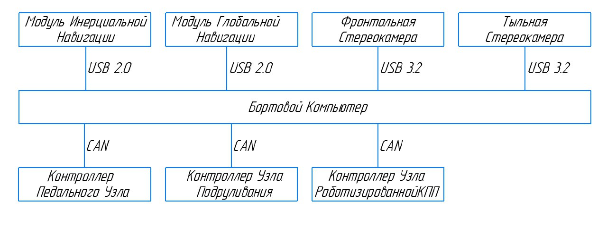

# Программное обеспечение беспилотного автомобиля
Пакет экосистемы Robot Operating System 2 (ROS2) для беспилотного автомобиля на базе LADA Granta.
## Введение
Программное обеспечение предназначено для реализации беспилотного движения автомобиля в рамках задач испытаний 
беспилотных робототехнических комплексов РОБОКРОСС. 
### Задачи беспилотного автомобиля в рамках испытаний
>Полигон основного этапа испытаний представляет из себя грутновую дорогу в форме дуги протяженностью около 200 метров
>с расположенными на ней статичными препятствиями в виде бочек и барьеров высотой более 0.5м. По бокам дорога ограждена 
>отбойниками по всей длине.

Основная задача транспортного средства - проехать до конца участка и вернуться в зону старта-финиша, объезжая все 
препятсвия. Ко вторичным заданиям относятся - движение по полигону, соблюдая требования дорожных знаков и дорожной разметки, 
параллельная парковка, перпендикулярная парковка задним ходом.  
Все задания выполняются раздельно, вторичные задания необязательны к выполнению, однако, разработанное ПО рассчитано на
выполнение тех дополнительных заданий, что описаны выше (имеются и другие доп. задания, которые тут не упомянуты).

## Аппаратная архитектура
В качестве платформы для развертывания высокоуровневой системы управления на роботе установлен компьютер с процессором 
Intel i7 12 поколения с интегрированной графической картой и 16 гб оперативной памяти под управлением операционной
системы Ubuntu 22.04.03 LTS (Jammy Jellyfish).  
Все электромеханические узлы для взаимодействия с органами управления автомобиля (педали, МКПП, руль) оснащены блоками 
управления на базе микроконтроллера STM32 и связаны с бортовым компьютером по CAN шине.  
Для локализации и позиционирования ТС оснащено глобальной и инерциальной навигационными системами, а также установлены 
датчики колесной одометрии: датчики скорости задних колес, датчик угла поворота рулевого вала.  
Для распознавания препятствий и картостроения на переднем и заднем бампере установлены стереокамеры.  
Структурная схема аппаратного оснащения беспилотника представлена на рисунке ниже.

## Программная архитектура
Обеспечение развернуто внутри фреймворка функционирования роботов ROS2 Humble. На двух рисунках ниже представлена 
структурная схема функционирования всех программ внутри системы.

